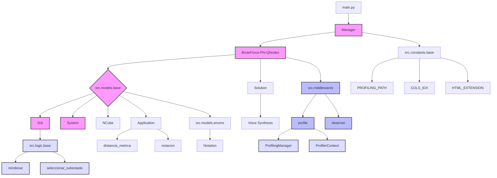

# Diagrama de Componentes

## Organización de Componentes

El diagrama de componentes muestra la estructura modular del sistema a nivel de implementación:

### 1. Componentes Principales
- `main.py`: Punto de entrada del sistema
- `Manager`: Gestión de configuración y recursos
- Estrategias (Phi/BruteForce/QNodes): Implementaciones concretas *(Pyphi es el módulo oficial, a pesar de esto utiliza fuerza bruta para la resolución del problema)*

### 2. Módulos Base
- `src.models.base`: Contiene las clases fundamentales
- `src.logic.base`: Implementa funciones auxiliares
- `src.constants/`: Define constantes globales o de modelos de datos

### 3. Middlewares
Proporcionan servicios transversales al sistema
- `profile`: Sistema de profiling
- `observer`: Sistema de monitoreo

### 4. Utilidades y Configuración
- Funciones de reindexación
- Selección de estados
- Configuraciones de la aplicación

El diagrama utiliza diferentes estilos visuales para distinguir:
- Componentes core (rosa)
- Middlewares (azul claro)
- Utilidades (azul muy claro)

Esta organización permite un desarrollo modular y mantenible, facilitando la extensión del sistema con nuevas funcionalidades.

¿Te gustaría que profundice en algún aspecto específico de alguno de los diagramas o que explique con más detalle alguna de las relaciones entre componentes?

