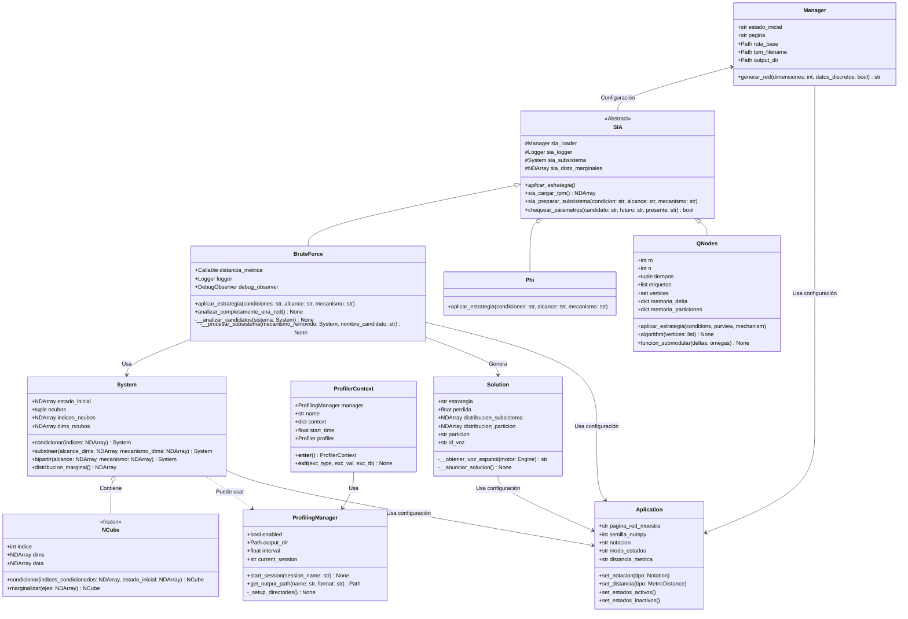

# Diagrama de Clases para Sistema Gestor (IIT4.0)

## Arquitectura General

El sistema está diseñado siguiendo una arquitectura modular y extensible para el análisis de Integrated Information Theory (IIT) sobre el problema de Irreducibilidad Sistémica. La estructura se puede dividir en varias capas fundamentales:

### 1. Capa de Gestión y Configuración

La clase `Aplication` es un Singleton que centraliza la configuración global del sistema. Su propósito principal es proporcionar un punto único de acceso para manejar parámetros clave que afectan el comportamiento de los análisis dentro del marco de IIT4.0, sea definir la configuración de la distancia métrica utilizada, la notación con la que se indexan los datos dentro el n-cubo, la semilla utilizada para que todos los grupos trabajen sobre los mismos datos en generaciones pseudo-aleatorias de las TPM's y definir si su lectura fue realizado sobre los nodos en ON u en OFF.

La clase `Manager` actúa como punto de entrada y configuración del sistema, proporcionando:
- Gestión de rutas y archivos para entrada/salida
- Configuración del estado inicial del sistema
- Generación de redes neuronales para análisis

### 2. Capa de Estrategias de Análisis

El sistema implementa el patrón Strategy a través de la clase abstracta `SIA` (Sistema de Información Abstracto) que define la interfaz común para diferentes estrategias de análisis:

- `BruteForce`: Implementa una búsqueda exhaustiva de todas las posibles particiones
- `Phi`: Librería oficial, cuál utiliza algoritmos optimizados para el cálculo de φ _(small phi)_
- `QNodes`: Implementa una estrategia basada en teoría de submodularidad

Cada estrategia hereda de `SIA` _(System Irreducibility Analysis)_ y debe implementar el método `aplicar_estrategia()`, permitiendo diferentes aproximaciones al problema usando el patrón [Strategy](https://refactoring.guru/es/design-patterns/strategy).

### 3. Núcleo de Procesamiento

El corazón del sistema está formado por dos clases fundamentales:

#### Class System
Representa un sistema completo de información integrada y proporciona las operaciones fundamentales de:
- Condicionamiento de estados (Background conditions)
- Generación de subsistemas (Substraer/Marginalizar/Ruido/Perturbar)
- Creación de biparticiones
- Cálculo de distribuciones marginales

#### Class NCube
Implementa la estructura de datos n-dimensional que representa los estados del sistema:
- Es una clase inmutable (frozen) para garantizar la integridad de los datos
- Maneja las operaciones de condicionamiento y marginalización
- Permite una representación eficiente de los estados del sistema

### 4. Sistema de Monitoreo y Profiling

El sistema incluye capacidades de monitoreo y profiling para poder ver cómo están rindiendo las estrategias:

#### Profiling
- `ProfilingManager`: Gestiona la configuración global del profiling
- `ProfilerContext`: Implementa el patrón Context para mediciones específicas
- Permite análisis detallado del rendimiento en diferentes partes del sistema

### 5. Representación de Resultados

La clase `Solution` encapsula los resultados definitivos ocurridos en un análisis mediante algúna estrategia:
- Almacena distribuciones de probabilidad y particiones
- Proporciona una visualización linda, formateadita de resultados
- Incluye capacidades de síntesis de voz para reportes _(es deshabilitable, por si)_

## Flujo de Datos Típico

1. El `Manager` inicializa el sistema
2. Se selecciona una estrategia (BruteForce/Phi/QNodes)
3. La estrategia utiliza `System` y `NCube` para análisis
4. Los resultados se encapsulan en `Solution`
5. El profiling y observación ocurren durante todo el proceso

## Patrones de Diseño Utilizados

El sistema intentó implementar varios patrones de diseño clásicos para practicar, mejorar la experiencia de usuario y darlos a conocer:
1. Strategy (implementaciones de SIA)
2. Singleton (sobre Application)
4. Context (sistema de profiling)
5. Immutable Object (para NCube)