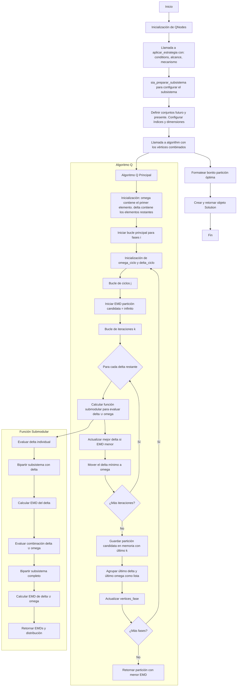

```mermaid
flowchart TD
    A[Inicio] --> B[Inicialización de QNodes]
    B --> C[Llamada a aplicar_estrategia con: conditions, alcance, mecanismo]
    
    C --> D[sia_preparar_subsistema para configurar el subsistema]
    D --> E[Definir conjuntos futuro y presente. Configurar índices y dimensiones]
    E --> G[Llamada a algorithm con los vértices combinados]
    
    G --> H[Algoritmo Q Principal]
    
    subgraph AlgoritmoQ["Algoritmo Q"]
        H --> I[Inicialización: omega contiene el primer elemento. delta contiene los elementos restantes]
        I --> J[Iniciar bucle principal para fases i]
        
        J --> K[Inicialización de omega_ciclo y delta_ciclo]
        K --> L[Bucle de ciclos j]
        
        L --> M[Iniciar EMD partición candidata = infinito]
        M --> N[Bucle de iteraciones k]
        
        N --> O{Para cada delta restante}
        O --> P[Calcular función submodular para evaluar delta ∪ omega]
        P --> Q[Actualizar mejor delta si EMD menor]
        Q --> R[Mover el delta mínimo a omega]
        R --> S{¿Más iteraciones?}
        S -->|Sí| O
        S -->|No| T[Guardar partición candidata en memoria con último k]
        
        T --> U[Agrupar último delta y último omega como lista]
        U --> V[Actualizar vertices_fase]
        V --> W{¿Más fases?}
        W -->|Sí| K
        W -->|No| X[Retornar partición con menor EMD]
    end
    
    subgraph FuncionSubmodular["Función Submodular"]
        P --> P1[Evaluar delta individual]
        P1 --> P4[Bipartir subsistema con delta]
        P4 --> P5[Calcular EMD del delta]
        P5 --> P6[Evaluar combinación delta ∪ omega]
        P6 --> P7[Bipartir subsistema completo]
        P7 --> P8[Calcular EMD de delta ∪ omega]
        P8 --> P9[Retornar EMDs y distribución]
    end
    
    G --> Y[Formatear bonito partición óptima]
    Y --> Z[Crear y retornar objeto Solution]
    Z --> AA[Fin]
```